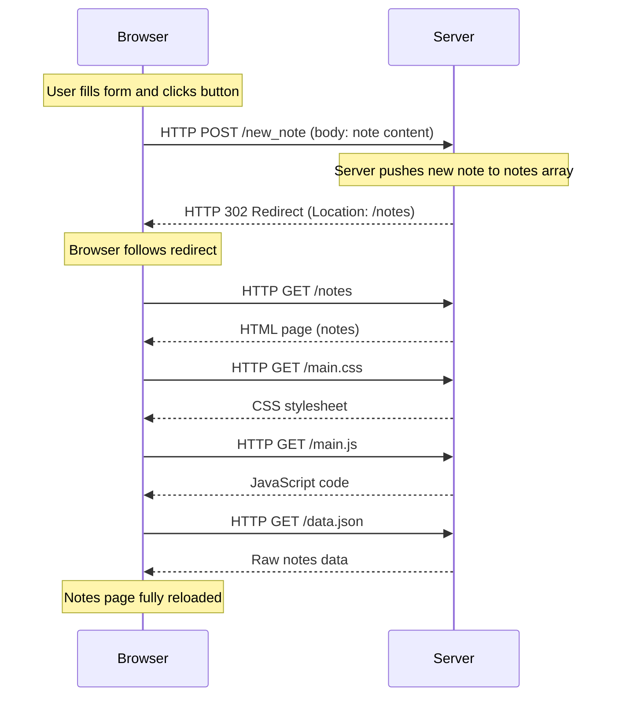

```mermaid
sequenceDiagram
    participant B as Browser
    participant S as Server

    Note over B: User fills form and clicks button
    B->>S: HTTP POST /new_note (body: note content)
    Note over S: Server pushes new note to notes array
    S-->>B: HTTP 302 Redirect (Location: /notes)
    Note over B: Browser follows redirect
    B->>S: HTTP GET /notes
    S-->>B: HTML page (notes)
    B->>S: HTTP GET /main.css
    S-->>B: CSS stylesheet
    B->>S: HTTP GET /main.js
    S-->>B: JavaScript code
    B->>S: HTTP GET /data.json
    S-->>B: Raw notes data
    Note over B: Notes page fully reloaded
```
