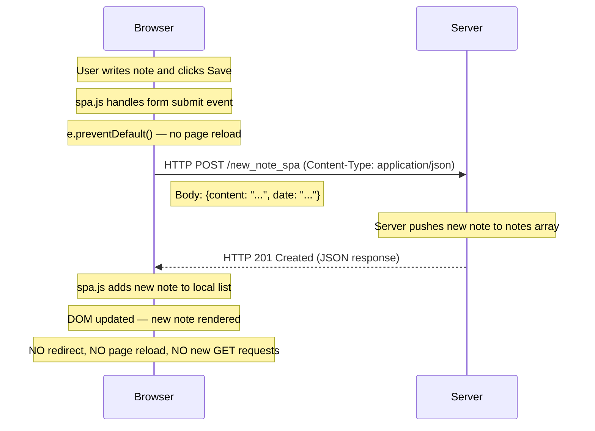

```mermaid
sequenceDiagram
    participant B as Browser
    participant S as Server

    Note over B: User writes note and clicks Save
    Note over B: spa.js handles form submit event
    Note over B: e.preventDefault() — no page reload
    
    B->>S: HTTP POST /new_note_spa (Content-Type: application/json)
    Note right of B: Body: {content: "...", date: "..."}
    
    Note over S: Server pushes new note to notes array
    S-->>B: HTTP 201 Created (JSON response)
    
    Note over B: spa.js adds new note to local list
    Note over B: DOM updated — new note rendered
    Note over B: NO redirect, NO page reload, NO new GET requests
```