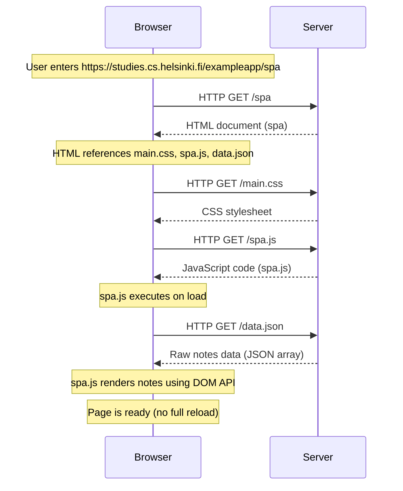

```mermaid
sequenceDiagram
    participant B as Browser
    participant S as Server

    Note over B: User enters https://studies.cs.helsinki.fi/exampleapp/spa
    B->>S: HTTP GET /spa
    S-->>B: HTML document (spa)
    
    Note over B: HTML references main.css, spa.js, data.json
    B->>S: HTTP GET /main.css
    S-->>B: CSS stylesheet
    
    B->>S: HTTP GET /spa.js
    S-->>B: JavaScript code (spa.js)
    
    Note over B: spa.js executes on load
    B->>S: HTTP GET /data.json
    S-->>B: Raw notes data (JSON array)
    
    Note over B: spa.js renders notes using DOM API
    Note over B: Page is ready (no full reload)
```